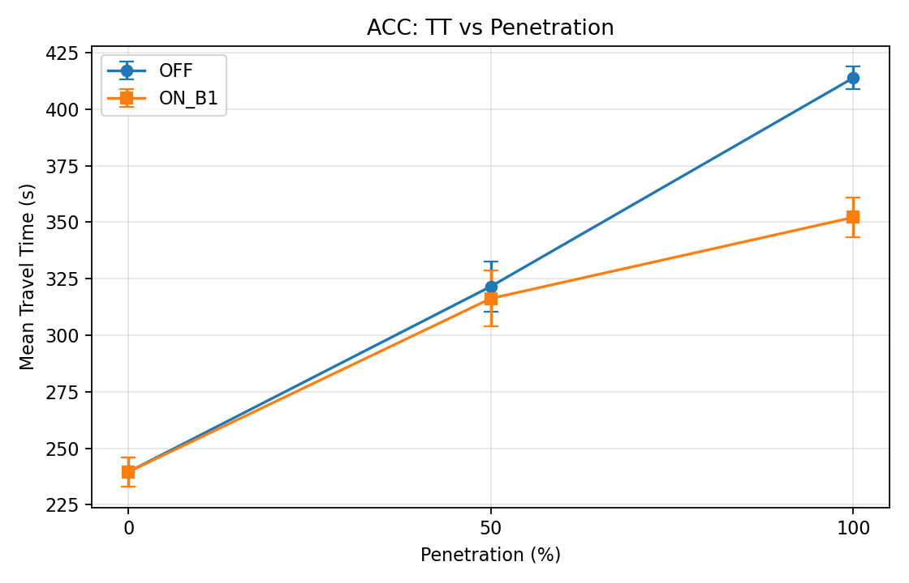
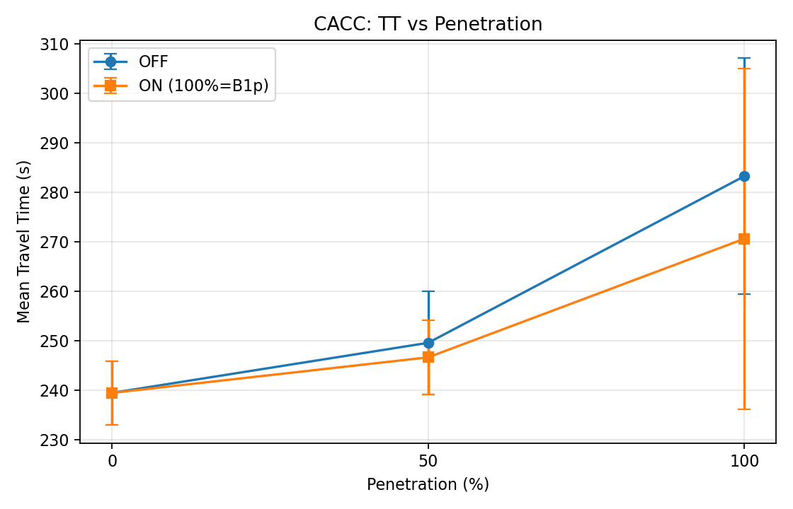
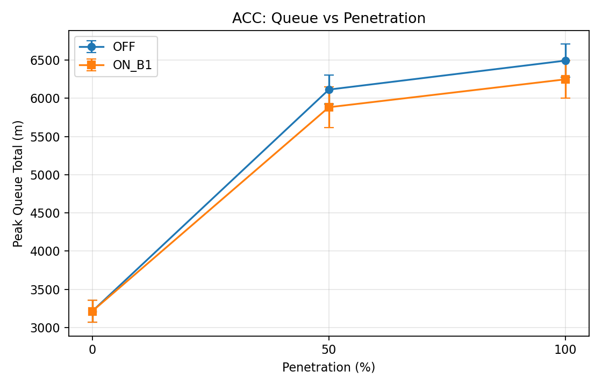
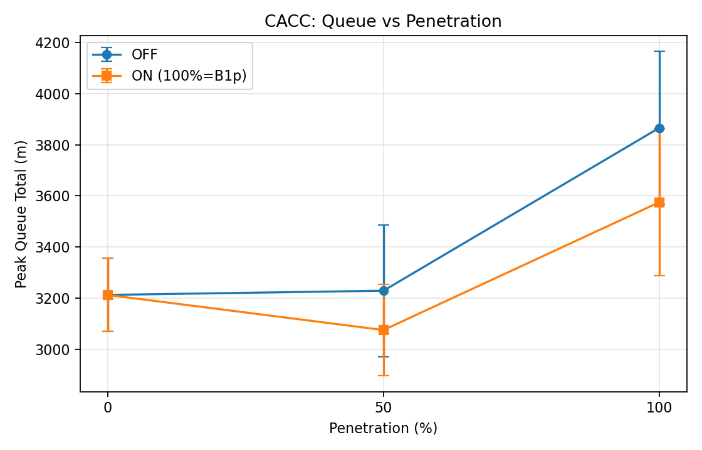

# Kataban CAV GLOSA Signal Control

Peak-hour mixed-traffic signal control study at Kataban intersection (Dhaka) in SUMO with RL signal control, fixed-time baseline, and CAV/GLOSA penetration experiments. This repository contains the cleaned final dataset and figures after removing all teleport issues.

## What is included

- Network: `network/kataban_joined_nomicros.net.xml`
- Demand files: `demand/routes_peak_*.rou.xml` for ACC/CACC penetration and GLOSA ON/OFF
- Controllers and evaluation scripts: `controllers/`
- Final RL checkpoint: `models/ppo_peak_final.zip`
- Final results: `results/mixed_traffic_runs.csv`, `results/mixed_traffic_aggregate.csv`, `results/delta_tt_summary.txt`
- Final figures: `figures/*.png`

## Final DeltaTT (%)

- ACC 0%: `0.000`
- ACC 50%: `-1.656`
- ACC 100%: `-14.906`
- CACC 0%: `0.000`
- CACC 50%: `-1.175`
- CACC 100% (ON_B1p): `-4.463`

Teleports are `0` across all final runs.

## Quick start

1. Set SUMO:

```powershell
$env:SUMO_HOME="C:\Program Files (x86)\Eclipse\Sumo"
$env:Path="$env:SUMO_HOME\bin;$env:Path"
$env:PYTHONPATH="$env:SUMO_HOME\tools"
```

2. Install Python dependencies:

```powershell
pip install -r requirements.txt
```

3. Run full evaluation matrix (if you want to regenerate):

```powershell
python controllers\run_eval_all.py
```

## Figures






## Notes

- CACC 100% ON uses `ON_B1p` settings (`range=180`, `min-speed=8`, `max-speedfactor=1.15`).
- ACC 100% OFF uses a corrected route/vType setup to remove the previous wrong-lane teleport.
